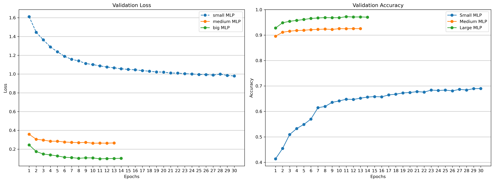

# Deep Learning Applications - Laboratory 1

## Overview
From basic MLPs to more complex CNNs with residual connections, this lab focuses on using PyTorch to create and compare different neural network architectures. Key deep learning concepts, especially the advantages of residual connections and explainability strategies, are intended to be validated by the experiments.

The main objective is not to achieve state-of-the-art performance, but rather to develop a solid understanding of the fundamental concepts, experiment with different architectures, and explore practical methods for interpreting and explaining model decisions.

## Project Structure
The project is structured as follows:
* __src__: contains all the source code.
    * ```trainer.py```: handles training and callbacks (e.g., EarlyStopping).
    * ```models.py```: defines the network architectures (CNN, ResNet, etc.).
* __models__: stores the trained models.
* __images__: contains images used for visualizations or examples.
* __wandb__: directory created by Weights & Biases for experiment logging (if enabled).

## Exercises
### Exercise 1.1: A baseline MLP
In this first experiment, a simple Multilayer Perceptron (MLP) was implemented to classify the 10 digits of the MNIST dataset. The model consists of two fully connected layers with ReLU activation. The MLP implementation can be found in ``` src/models.py ``` as the MLP class. 

To study the effect of model capacity, three different configurations were tested:

* Small MLP: hidden size = 3
* Medium MLP: hidden size = 10
* Large MLP: hidden size = 64

All models were trained with the same hyperparameters, using early stopping to prevent overfitting, and their training process was monitored with Weights & Biases for real-time tracking of validation loss and accuracy.

Among the three variants, the Large MLP (hidden size = 64) achieved the best performance, showing the benefits of increasing the representational capacity of the network while still maintaining a simple architecture.


| Model      |hidden size | Test Loss  | Test Accuracy (%) |
|----------  |------------|------------|------------|
| Small MLP  | 3          | 0.9470       | 69.92         |
| Medium MLP | 10         | 0.2465       | 92.75         |
| Large MLP  | 64         | 0.0915       | 97.35         |



### Exercise 1.2: Adding Residual Connections

For Exercise 1.2, the previous MLPs were extended by introducing residual blocks. A residual block consists of one or more linear layers with a **skip connection** that adds the block’s input to its final output before the activation function. The main advantage of residual blocks is to mitigate the vanishing gradient problem in deeper networks: the skip connections allow gradients to flow more easily, making training deeper networks more stable and faster.

Residual versions of “Medium” and “Large” MLPs were implemented using the same hidden size but adding a configurable number of residual blocks. In general, the final performance (loss and accuracy) of residual and classical MLPs is similar. However, we observed that residual MLPs converge **faster**: early stopping triggers sooner than for the standard MLP, reducing the number of training epochs without impacting final metrics.


| Model               |hidden size |n. res. blocks|n. epochs | Test Loss  | Test Accuracy (%) |
|---------------------|------------|--------------|----------|------------|------------|
| Medium MLP          | 10         |0             |29        | 0.2394     | 93.22      |
| Medium Residual MLP | 10         |3             |11        | 0.1796     | 94.59      |
| Large MLP           | 64         |0             |24        | 0.0876     | 97.53      |
| Large Residual MLP  | 64         |3             |9         | 0.1039     | 97.09      |


### Exercise 1.3: Rinse and Repeat (but with a CNN)
In this exercise, we extended the verification from the MLP setting to CNNs, using CIFAR-10 as the dataset. The goal was to compare deeper CNNs without residual connections against even deeper CNNs with residual connections, and evaluate their performance in terms of validation loss and accuracy.

Three different architectures were compared:

1. **SimpleCNN**:
A very shallow baseline model with two convolutional layers followed by max pooling. It extracts simple spatial features and feeds them into two fully connected layers for classification. This model has very limited capacity and serves as a starting point for comparison. The implementation can be found in ``` src/models.py ``` as the ```SimpleCNN()``` class. 

2. **CNN**:
A deeper custom CNN with three convolutional stages, each consisting of two convolutional layers with batch normalization and ReLU activations, followed by max pooling. The extracted features are passed to a fully connected classifier with dropout regularization. This model has significantly higher capacity than SimpleCNN, but no residual connections. The implementation can be found in ``` src/models.py ``` as the ```CNN()``` class.

3. **ResNet-18**:
A standard residual network architecture, where the core building blocks include skip connections that allow inputs to bypass convolutional transformations. The net was not pre-trained. The implementation can be found in ``` src/models.py ``` as the ```ResNet18()``` class.

| Model      | Val. Loss  | Val. Accuracy (%) |
|----------  |------------|------------|
| SimpleCNN  |0.9796      | 68.66        |
|       CNN  |0.8576      | 79.18         |
| Resnet18   |0.8715      | 75.65         |

All experiments were run with early stopping and the following hyperparameters: ```batch_size=128```, Adam optimizer with ```le=0.001```, ```n_epochs=30```.

The results reported in the table show that **SimpleCNN** performs the worst, as expected, since its small capacity limits its ability to capture the complexity of CIFAR-10.

The deeper **CNN** significantly outperforms the simple baseline, achieving ~79% validation accuracy. This shows that adding depth (even without residual connections) can  improve performance, at least up to a certain level of complexity.

Surprisingly, **ResNet-18** underperforms compared to the custom CNN, reaching only ~75% validation accuracy. Although residual connections allow deeper networks to train more effectively, this result highlights that **deeper is not always better**, especially when training conditions (e.g., learning rate schedules, data augmentation, or regularization) are not fully optimized for very deep models. It is important to note that these networks were not heavily optimized, since the purpose of this exercise is not to achieve state-of-the-art performance but rather to illustrate the effect of depth and residual connections on training dynamics.

**add image** wandb comparison


### Exercise 2.1: Fine-tune a pre-trained model
We experimented with transferring the CNN trained on CIFAR-10 to CIFAR-100. A stable baseline was established by extracting features from the pre-trained model and training a classical classifier (SVM) on them. Then, the network was fine-tuned using two strategies: training only the classifier, or training both the classifier and the last convolutional block.


|Method / Strategy                          | Val. Accuracy (%) |
|------------                               |-------------------|
| SVM baseline                              | 19.0              |
| Fine-Tuning - Classifier Only             | 42.06             |
| Fine-Tuning - Last Conv Block + Classifier| 44.86             |

These results are disappointing, highlighting the challenges of transferring a model trained on CIFAR-10 to CIFAR-100. However, this analysis was included in the work since the goal of this exercise was to practice and understand fine-tuning strategies, rather than to achieve state-of-the-art performance.

### Exercise 2.3: Explain the predictions of a CNN
In this exercise, we use Class Activation Maps (CAMs) to visualize which regions of an image a CNN attends to when making predictions. This technique helps understand the spatial focus of a trained network for discriminative classification. 
For this specific purpose the [pytorch-grad-cam](https://github.com/jacobgil/pytorch-grad-cam) package was used. 

**add image**
