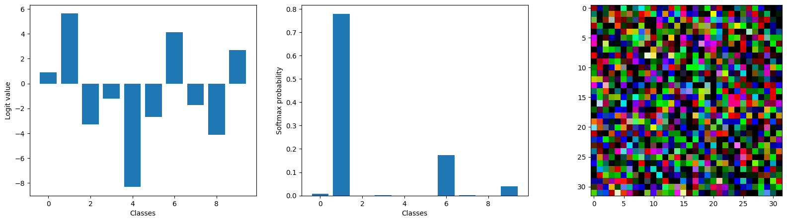
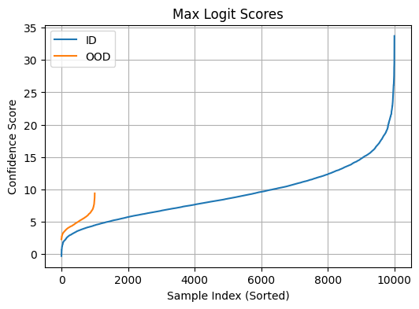
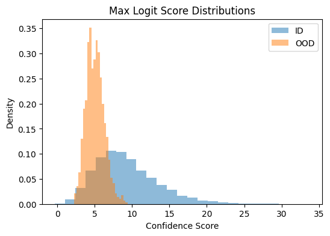
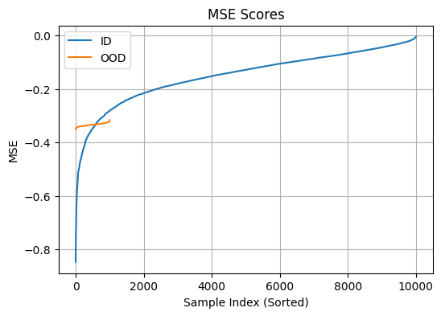
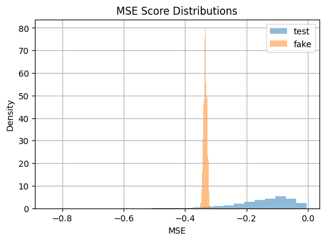

# Deep Learning Applications - Laboratory 4

## Overview


## Project Structure


## Exercises


### Exercise 1: OOD Detection and Performance Evaluation

This exercise explores the implementation and evaluation of a simple pipeline for Out-of-Distribution (OOD) detection. The objective is to train a model on a known dataset and then test its ability to recognize and flag inputs that are fundamentally different from what it has seen during training. 

To create a clear OOD scenario, the CIFAR-10 dataset was chosen as the In-Distribution (ID) source, while for the Out-of-Distribution (OOD) data random noise images were generated using ```torchvision.datasets.FakeData```.

<p float="center">
  
  
</p>

The idea is to develop a method that can discriminate CIFAR-10 images from random inputs using a model trained only on the ID data. To do so two distinct approaches were investigated:

#### 1) OOD Detection via classifier confidence:

The first detection strategy was based on the confidence score of a standard classifier. The idea is that a model should be highly confident when classifying an image from its training distribution (ID) and low confidence when presented with an unfamiliar OOD sample.

To test this a __CNN__ was trained for 50 epochs on the CIFAR-10 dataset. Then, to measure its confidence on new images, the __maximum logit__ value from the model's final layer was used as a score. This method showed a separation between the score distributions for ID and OOD data as we can observe from the histogram. Then this separation ability was quantitatively measured using the Area Under the Receiver Operating Characteristic (__ROC__) curve, achieving an AUC score of __0.79__. This result confirms that model confidence can serve as a useful score for OOD detection.

<p float="center">
  
</p>
<p float="center">
  
</p>

<p float="center">
  
  
</p>

#### 2) OOD Detection via Reconstruction Error:

An alternative approach was also investigated using an __Autoencoder__'s reconstruction error. An autoencoder is a specialized network trained to compress and then accurately reconstruct its input. The idea is that this network should be expert in reconstructing familiar CIFAR-10 images but struggle to reconstruct the random OOD images. The __Mean Squared Error (MSE)__ between an original image and its reconstruction was used as score. This method proved to work well, as the reconstruction errors for OOD samples were consistently higher than for ID samples. This method obtained an AUC score of __0.82__ .

<p float="center">
  
  
</p>


### Exercise 2.1: Implement FGSM and generate adversarial examples

The goal is to implement **the Fast Gradient Sign Method (FGSM)** to generate an *adversarial example*: a slightly modified input image designed to be misclassified by the model, while remaining visually indistinguishable from the original to the human eye. 

FGSM operates by performing a single-step perturbation on the input image. The core idea is to find the **direction** in the input space that will most increase the model's classification error. This direction is determined by calculating the **gradient** of the loss function with respect to the input image's pixels.

The attack then nudges each pixel in the direction indicated by the *sign* of its corresponding gradient. The magnitude of this __nudge__ is controlled by a small hyperparameter, epsilon ($\epsilon$), which represents the attack's __budget__ and ensures the perturbation remains subtle and difficult for a human to perceive.

$$ \boldsymbol{\eta}(\mathbf{x}) = \varepsilon \mathrm{sign}(\nabla_{\mathbf{x}} \mathcal{L}(\boldsymbol{\theta}, \mathbf{x}, y)) ) $$


The experiment began by selecting a correctly classified image from the CIFAR-10 test set. The trained CNN confidently assigned the correct label to this original image, establishing a baseline. The, the FGSM algorithm was applied to generate a perturbed, adversarial version of this same image.

Visually, the generated adversarial example was nearly identical to the original image. The perturbation was so subtle that it was imperceptible to the human eye. By visualizing the mathematical difference between the original and adversarial images, the perturbation was revealed to be a noise-like pattern distributed across the entire image. 

__add images__

Quantitatively, the attack was highly successful. Despite the imperceptible visual change, the model's prediction completely shifted. The CNN, which had correctly classified the original image, confidently assigned the incorrect target label to the adversarial version. This outcome was achieved with a very small epsilon value, highlighting the model's sensitivity to carefully crafted input noise.

__add results__


### Exercise 2.2: Augment training with adversarial examples

This exercise explores the relationship between adversarial robustness and Out-of-Distribution (OOD) detection in deep learning models. The primary goal is to train a CNN on the CIFAR-10 dataset and then evaluate how its ability to detect OOD samples changes after being retrained with adversarial examples.

The key experiments are:

1.  Training a standard CNN on CIFAR-10 and evaluating its baseline OOD detection performance against random `FakeData`.
2.  Implementing the Fast Gradient Sign Method (FGSM) to augment the training data "on the fly".
3.  Training a new "robust" model on this augmented dataset.
4.  Analyzing and explaining the significant change in OOD detection performance of the robust model.


To improve model robustness against adversarial attacks, the training process was augmented with __adversarially perturbed__ examples generated in real-time for each batch with the FGSM method. This new trained model is referred as _Robust model_.

After training the robust model for 50 epochs, its OOD detection performance was evaluated using the `max_softmax` confidence score. The results showed a dramatic degradation in performance.

|Model         |AUC |
|--------------|----|
|Baseline model|0.97|
|Robust model  |0.26|

__add histogram_

The histogram above clearly illustrates the problem. The distribution for OOD samples (orange, from `FakeData`) is shifted to the **right** of the distribution for ID samples (blue, from CIFAR-10). This indicates that the adversarially trained model is now **more confident** about random noise than it is about the actual data it was trained to classify.

The degradation in OOD performance is a consequence of the adversarial training process.
Adversarial training aims to make a model more robust teaching it to confidently classify an image even with minor perturbations. This learned "stubbornness" creates an unintended side effect when presented with Out-of-Distribution (OOD) data, which can be viewed as an extreme perturbation. Unlike a standard model that produces a low-confidence output for OOD inputs, the robust model misinterprets the noise as a simple perturbation. Consequently, confidently—but incorrectly—classifies the OOD sample into one of its known categories, resulting in a high confidence score that fundamentally breaks its ability to function as an effective OOD detector.

__add histograms__

This effect can be visualized in the score distribution histogram. While a good OOD detector should show high confidence for ID samples and low confidence for OOD samples, the histogram reveals the opposite: both distributions are pushed to the far right, with the confidence scores for OOD data being higher than for the ID data. This inversion occurs because the model's learned "stubbornness" causes it to misinterpret the random OOD noise as just another perturbation, which it then confidently—but incorrectly—classifies into one of its known categories as stated above.

This experiment highlighted a significant trade-off between **adversarial robustness** and **Out-of-Distribution detection**. The very mechanism that makes a model robust to small perturbations can severely damage its ability to recognize when an input is fundamentally different from its training data.


### Exercise 3.3: Experiment with *targeted* adversarial attacks

In __targeted__ attacks, instead of perturbing the input image to maximize the loss with respect to its true label, the attack is to *minimize* the loss with respect to the desired target label. This is achieved by moving the input image's pixels in the opposite direction of the gradient sign, effectively performing a one-step gradient descent towards the target class.

$$x_{\text{adv}} = x - \epsilon \cdot \text{sign}(\nabla_{x} J(\theta, x, y_{\text{target}}))$$

An image from the CIFAR-10 test set, initially classified correctly by the model, was selected as the victim. The targeted attack was then executed with the goal of forcing a misclassification to a different, chosen class (e.g., making the model see an "airplane" instead of a "cat").

Qualitatively, the generated adversarial image remained visually identical to the original, with the perturbation being an imperceptible layer of noise. Quantitatively, the attack successfully fooled the model: the network, which was previously confident in the correct label, confidently and incorrectly classified the perturbed image as the specific target class.

__add images__